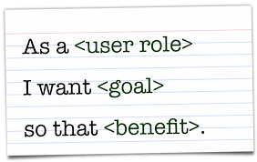

# CSPB-3308  Lab 3 :  Team Meeting (Agile Sizing) 
<figure width=100%>
  
</figure>
 

This will be the first time for many of you to work on a project that has multiple developers.  One of the fundamental reasons that teams give for their success is constant communications including a weekly meeting with all team members.   You will schedule a team meeting for this lab.  You need to find a time where all the members can meet so they can participate in the lab.  During your meeting you will perform an Agile task to review the set of **user stories** and gauge the effort that would be involved to meet the request's functionality.   This is not the design or scheduling of the tasks, but a quick estimate of the effort needed.  All team members must agree on the level of effort required through rounds of discussion and individual estimation.


<hr>

In the first part of this assignment you will be given a set of user stories that must be sized for the amount of effort it would require.   You will need to communicate your reasons for selecting a particular effort level to the rest of your team and listen to the others about their reasons.  After a couple rounds of sizing you will record the relative size of the effort and continue with the next **user story**. Once all items have been sized, as a team you will create a set of acceptance criteria for each of the user stories and create a summary of your results.

In the second part of the assignment, you will each individually continue to write scripts to process data.


**Objectives**
* practice the art of estimating the level of work required
* communicatimg information and ideas to others
* working with group dynamics
* create scripts that will process data
* create Python scripts / programs to process data

<hr><hr><hr>

Project has following folder tree:
```
.  
├── images  
|   └── ...  
├── LAB_3_DATA
|   └── User_Stories.txt 
├── README.md  
└── LAB_3_README.md
```

| File | Description |
|---|---|
| images                  | directory holding images for README.md |
| &nbsp;&nbsp;&nbsp;&nbsp;...        |  |
| LAB_3_DATA              | directory holding data used in Lab-3.  There may be multiple data files of each type in the directory |
| &nbsp;&nbsp;&nbsp;&nbsp;User_Stories.txt       | set of user stories from which each teams stories are selected |
| __README.md__           | __Readme file you are viewing here__ |
| LAB_3_README.md         | Readme file for Lab-1 instructions |

<hr>

### Your submission for this assignment

For your submission you **commit** all the files that have been created or modified in the Lab-3 repository.  The **commit** will update your local repository, but not the remote classroom repository.  You must **push** your local repository changes to the remote repository. You will also need to submit information in the Moodle assignment.
<br><br>


You will also need to **commit** and **push** the Lab-1 repository as you will have made changes to files in that repository.
<br><br>

We suggest that you **commit** and **push** your changes often. Each time you complete a step of the tutorial, **commit** the changes in that repository with a commit message indicating the step that has been completed.

### Getting Started
You must **clone** this repository  on to your virtual csel.io machine and/or your local machine.  This can be accomplished using the GUI interface (see videos provided in Moodle) or using the command line.  To **clone** this repository from the command line, change directory to where you want to create the new repository directory and use the command below which will create a directory and populate it with any files and directories in the repository :
```
  git clone https://github.com/cu-cspb-3308-software-dev-summer-2022/<your repository name>.git
```
The **URL** specified for the **clone** is the name of the repository that you received when you accepted the assignment in GitHub Classroom.
<hr>

## CSPB-3308  [Lab 3 :  Team Meeting (Agile Sizing)](LAB_3_README.md)
In this assignment you will meet with your team and produce a document that lists your team results. 


Each team member will add this results document to their assignment repository.  
<br><br>


Each team is given a set of **User Stories** that describe a feature that is needed by a user.  Your elected scrum master will get those stories from the instructor.  Your team will discuss each of these stories and come to a consensus on the level of effort required to implement the feature.  Once all the stories have been "sized", you will design a set of acceptance criteria for each of the user stories. Acceptance criteria will describe the context, the action that will be performed and/or completed, and the set of observable outcomes.
<br><br>


In Part 2 of the lab, you will go back to the repository for Lab-1 and continue to make new scripts.  You will also need to **commit** and **push** changes in that repository.
<br><br>

<hr>

### When you have completed the Lab tutorial.
**IMPORTANT**: Make sure that all your changes are **pushed** to the remote repository before going to Moodle to submit your completion information in the Moodle assignment.

<hr><hr><hr>
