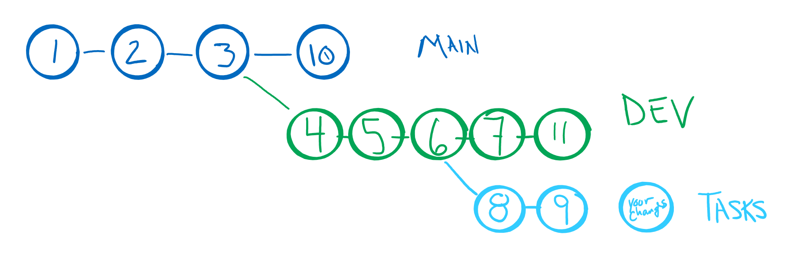

### Lab Tutorial Step Descriptions
<hr>
1. Make sure the simple.html file is committed to MAIN branch

 * Take a look at the current commit log: `git log` 
 * if `sample.html` file not in repository
   * create simple file

```
     echo "hello world!" > sample.html
```

   * add `sample.html` file to repository
   * commit first HTML sample file
<hr>

2. Make sure the default branch is named MAIN
 * Change the default branch name to MAIN
   * check the current branch (could be `main` or `master`)
   * change the name to `MAIN`
   
    <br>Here are the git options that are being used in this command:
    
```
        -m
        --move
            Move/rename a branch and the corresponding reflog.

        -M
            Shortcut for --move --force.
            
        --force
            Reset <branchname> to <startpoint> if <branchname> exists already. 
            Without -f git branch refuses to change an existing branch. 
            In combination with -m (or --move), allow renaming the branch even 
            if the new branch name already exists.

```

    We will use the following commands with the `-M` option to rename the current `main` to `MAIN`.
    This is just to keep all your branches in caps for this lab.  You will retain an unused `main` branch in your remote repository.
    
```
         git branch -M MAIN
         git push -u origin MAIN
```

 * HTML is a markup language that instructs the browser in displaying the information in a file
	* Open the file in a browser window
		* in JupyterHub editing environment: right click filename , select `Open in New Browser Tab`
		* in Visual Studio Code: right click filename, select download, click on downloaded file

	* Open the simple.html file in an editor
	* Notice there is only text, but the browser knows how to display text
<hr>

3. Modify the HTML file to use header tag around the text
 * HTML uses tags to mark sections of the document with display attributes
 * Tags usually have a starting tag and an ending tag surrounding the text to which the attributes are to be applied
 * Add a start tag `<H1>` before the first character of the text and an end tag `</H1>` after the last character
 * Display the new file in the browser (make sure to save file before trying to display)
 * Notice that the text is larger.  The `<H1>` tag specifies that the text is a header, meaning it is larger and bolder than regular text.
 * **commit** the changes to the `sample.html` file with `"#2 updated the text to use header tag"` as the comment message.
<hr>

4. Add the minimal HTML tags usually found in a page
 * Although the browser can display the simplest text files, every HTML file usually has a basic set of tags to setup the browser.
 * Try accessing any page in a browser window (Try the Moodle page for this course or your GitHub repository page)
 * Right-click on the page and select `View page source`
   * Notice the tags `<...>` 
   * The first tag in the file `<!DOCTYPE html>` specifies the type of document that is being rendered by the rest of the text in the file.
   * The following are the basic tags used in every HTML file are shown below.
 * Edit your `sample.html` file to match the text listed below with the minimal tags for an HTML file:
```
			<!DOCTYPE html>
			<html>
			<head>
			</head>

			<body>

			<h1>hello world!</h1>

			</body>
			</html>
```
 * **commit** the changes to the `sample.html` file with `"#3 added the minimal HTML tags"` as the comment message.
 * Display the new file in the browser (make sure to save file before trying to display)
 * The start and stop tag do not need to have anything between them. 
 * The `<head>` section is usually filled with information about the document as a whole.  
 * Take another look at a generic web page and see the information provided in the `<head>` section.  
 
<hr>
	
5. Add a new branch for development: DEV
 * Let's leave that change as the lastest release for users.  
 * All changes going forward will be done on a separate branch called DEV.
 * Even when we have changed a file in the DEV branch, the file will remain unchanged in the MAIN branch
 * Create the new branch in the repository `git branch DEV`
 * Check the current branch with `git branch` command.  
 * All the branches will be listed and the current branch is indicated.  
 * If you want to see the last commit for each branch use `git branch -v`.
<hr>

6. Switch from the MAIN branch to the DEV branch
 * Check the branches again and see the indicator has moved.

```
			git switch DEV
			git branch -v
```
<hr>

7. Create a title for the page's tab in browser
 * One of the tags available will set the title on the browser page.  
 * The title text is seen in the tab of the browser (or across the top of the page) and can be set by the page itself.
 * The title information is placed inside a `<head>` section of the document.   
```
		...
			<head>
				<title>Sample Page 3308</title>
			</head>
		...
```


 * View your changes to the file by using the browser to display the new file.  
 * You should see that the tab title has changed from a URL to the string we provided.
 * Now we can save those changes to the repository.
 * **commit** the changes to the `sample.html` file with `"#4 added text for page title"` as the comment message.
 * Verify the commit is in the DEV branch using `git branch -v`
 * Notice that the MAIN branch still has its last commit as `"added the minimal HTML tags"`
 * DEV branch should have  `"added text for page title"` for last commit

<hr>

8. Modify the text specifically for CSPB 3308
 * The text is generic in the HTML.  Make it a bit more personal.
 * Change title to `Welcome to the 3308 World!`
 * Change text in the **body** to `Hello 3308 students and welcome to the world of Software Dev!` 
 * Verify the page displays correctly
 * **commit** the changes to the `sample.html` file with `"#5 modified text specifically for 3308"` as the comment message.
 * There are now two commits on the DEV branch
 * Use `git log` to see the commits 
<hr>

9. Place a marker that will be replaced by students later
 * Add the follow text just below the `</H1>` 

```
		... 
			<h1>Hello 3308 students and welcome to the world of Software Dev!</h1>
		
			<center>Here is some text to be changed by you.</center>
		...	
```


 * Verify the page displays correctly
 * **commit** the changes to the `sample.html` file with `"# 6.  added text to be changed by student"` as the comment message.
 * There are now three commits on the DEV branch, 3 on the MAIN branch
 * Use ` git log --graph --all` to see the commits in a graph form.
 * The graph form will become more useful as we create more interleaving branches and merging branches.

<hr>

10. Add a new branch (TASKS) for a developer to try adding tasks the page
   * The DEV branch was for all of the development team to use.  
   * The page is currently stable, but we want to see what it would look like if we add some tasks for students to perform.
   * These changes may not be what we need or they might break some of the working code, so we need to do it all in another branch.
   * Once we have verified the changes are wanted by development, we can merge them back into the DEV branch.
   * Create new branch using `git branch TASKS`
   * The previous command created the new branch, but we are still using the DEV branch.
<hr>

11. Add logo to the DEV branch
   * Other developers are working on the project at the same time
   * Lets simulate a change merged into DEV by another developer
   * Make sure we are using the DEV branch with `git switch DEV`
   * Edit the `sample.html` file to include a CU logo
   * Ignore the `` tag, but notice the URL and the alternate text

```
	...
		<h1>Hello 3308 students and welcome to the world of Software Dev!</h1>

		<div></div>

		<center>Here is some text to be changed by you.</center>
	...
```

   * Verify the page displays correctly (logo should show up, not the alternate text)
   * **commit** the changes to the `sample.html` file with `"# 7. added CU logo"` as the comment message.
   * This commit is part of the DEV branch
<hr>

12. Now switch to TASKS branch
 * We will leave the DEV branch and goto the TASKS branch
 * Remember that the TASKS branch is one commit back from the DEV branch
 * When we switch to TASKS branch, our files in the project directory will be returned to the current start of that branch
 * In this case, the logo is no longer inserted into the HTML file because it was committed on the DEV branch
 * You will see the changes when you open the file in an editor (you may need to close the old editor and reopen to see the changes)

```
			<!DOCTYPE html>
			<html>
			<head>
				<title>Welcome to the 3308 World!</title>
			</head>
			<body>

				<h1>Hello 3308 students and welcome to the world of Software Dev!</h1>
				
				<center>Here is some text to be changed by you.</center>

			</body>
			</html>
```
<hr>

13. Add text to page about student tasks to be performed
   * Split one of the current lines in the HTML file across two lines
   * HTML allows for comments to be inserted within the HTML file
   * Insert the text below into the HTML file

```	
		...
				<center>Here is some text to    <!-- text is split over two lines here but not in the rendered page -->
					be changed by you.</center>
				
				<!-- xmp tag ignores all the tags until seeing the closing xmp tag.  Tag is no longer used, but useful here -->
				<xmp> 
				1. Replace the text above with a short bio 
					(your name, time zone, first degree, something you have learned recently outside of class)
					
				2. Try placing some of the different tags listed below (be sure to add starting and ending tags) 
					around some of your text to see what they do:

					<i>...</i>
					<b>...</b>
					<em>...</em>
					<strong>...</strong>
					<sup>...</sup>
					<sub>...</sub>
				</xmp>
			</body>
		... 
```


   * Verify the page displays correctly (no logo should show up, new text should appear)
   * **commit** the changes to the `sample.html` file with `"# 8. added student tasks"` as the comment message.
   * This commit is part of the TASKS branch
   *  Try the graphic version of the log. Try a less verbose output:
			git log --graph  --format=format:'%C(yellow) %s %d' --all 
   * The image to the right is a visual representation of the commits that have been made
<br><br><br>
<hr>

14. Update the task instructions
   * Besides the exploration of the different HTML attribute tags listed above, you will also learn to **merge**  branches
   * There is a tag in HTML to create an ordered list on the page.  
   * The `<ol>` tag indicates the beginning of an ordered list.
   * Each `<li> ... </li>` tags marks the text to be included in a numbered item

   * Insert the text below into the HTML file just before the closing `</body>` tag

```
	Here is what changes you will be making to the repository branches:
	<ol>
		<li>Merge branch TASKS into branch DEV </li>
		<li>Merge branch DEV into branch main</li>
		<li>Create new branch from the DEV branch to complete the next step</li>
		</ol>
```

   * Verify the page displays correctly (new text should appear in numbered list)
   * **commit** the changes to the `sample.html` file with `"# 9.  updated the task instructions"` as the comment message.
 
<hr>

15. In MAIN branch add an HTML comment and capitalize the text
   * Again we will create a **commit** as if another developer merged a branch into MAIN branch
   * Switch to the MAIN branch
   * Verify the `sample.html` file is back to the version that was last committed to the MAIN branch
```
	...
		<body>

			<h1>hello world!</h1>

		</body>
	...
```
   * Modify the body of the page to 
```
	...
		<body>
			<!-- this is an HTML comment -->
			<h1>Hello World!</h1>
		</body>
	...
```
   * **commit** the changes to the `sample.html` file with `"#10. show a comment tag, capitalized words"` as the comment message.
   * This commit will be in the MAIN branch
<hr>

16. In DEV branch, update page to include two logos 
   * Once more we will create a **commit** as if another developer merged a branch into DEV branch
   * Switch to the DEV branch
   * Verify the `sample.html` file is back to the version that was last committed to the DEV branch
```
	...
		<body>

			<h1>Hello 3308 students and welcome to the world of Software Dev!</h1>
			<div></div>

			<center>Here is some text to be changed by you.</center>

		</body>
	...
```
   * Add a second logo immediately after the first
```
	...

			<div></div>
	...
```


   * Verify the page displays correctly (two logos should appear)
   * **commit** the changes to the `sample.html` file with `"#11. added 3308 logo"` as the comment message.
   * This commit will be in the DEV branch

   * The commit tree for the current repository should look like the image to the right.
   * Use the graph log to see the commit tree 

			git log --graph  --format=format:'%C(yellow) %s %d' --all 
<hr>

17. The development team has determined that the DEV branch is ready for release to users
   * You need to merge the DEV branch into MAIN branch
   * Switch to the receiving branch (MAIN)
   * **merge** the DEV branch into the MAIN branch
```
		$ git merge DEV
		Auto-merging sample.html
		CONFLICT (content): Merge conflict in sample.html
		Automatic merge failed; fix conflicts and then commit the result.
```

   * Because there are modifications to the same file in both branches, a **merge conflict** is detected
   * The conflict must be resolved by editing the source file
   * Open the `sample.html` to see the conflict:

```
		<!DOCTYPE html>
		<html>
		<head>
			<title>Welcome to the 3308 World!</title>
		</head>
		<body>
		<<<<<<< HEAD
		<!-- this is an HTML comment -->
		<h1>Hello World!</h1>
		=======
			<h1>Hello 3308 students and welcome to the world of Software Dev!</h1>
			<div></div>

			<div></div>

			<center>Here is some text to be changed by you.</center>
		>>>>>>> DEV

		</body>
		</html>
```

   * The file with a merge conflict will have the lines from both of the versions of the files.  
   * The changes are marked by `<<<<<<< HEAD`, `=======` and `>>>>>>> DEV` marker in the text.  
   * You need to edit the file to merge the two versions.  

```
		<!DOCTYPE html>
		<html>
		<head>
			<title>Welcome to the 3308 World!</title>
		</head>
		<body> <!-- this is an HTML comment -->
			<h1>Hello 3308 students and welcome to the world of Software Dev!</h1>
			<div></div>

			<div></div>

			<center>Here is some text to be changed by you.</center>
		</body>
		</html>
```

   * Once you have merged the code, verify it displays correctly
   * **commit** the changes to the `sample.html` file with `"#12. merged DEV into MAIN"` as the comment message.
   * See the merging of the two branches

```
		$ git log --graph  --format=format:'%C(yellow) %s %d' --all
```

<hr>

18. You must edit the `sample.html` file one more time
   * Switch to the TASKS branch
   * Try the different emphasis attributes on words or phrases in the page
   * Remember to create a starting and ending tag around the word or phrase
   * Add more text if you want to try all the different tags 
   
   * Make sure the page displays as you intended
   * **commit** the changes to the `sample.html` file with `"#13 emphsized the text"` as the comment message.
   * This commit will be in the TASKS branch
<hr>

19. You have completed the TASKS branch and it is ready for release to rest of development team

   * Merge the TASKS branch into DEV branch
   * Switch to the receiving branch (DEV)
   * **merge** the TASKS branch into the DEV branch
   * There will be conflicts again
   * Resolve the conflicts and commit the files with `"#14 TASKS merged with DEV"` as the comment message.
   * Final graph should show the TASKS merged into DEV 


<hr>

20. You have completed all the steps in the assignment
   * The TASKS branch has be merged into DEV and is no longer needed
   * Remove the TASKS branch to keep the repository organized
   * You cannot delete the current branch (that is okay because we had switched to DEV branch)
 
 ```
		git branch -d TASKS
 ```
 
   * Be sure to **push** all these changes to the remote repository.
   * Be sure to submit the correct information to the Moodle assignment
<hr>
<hr>
<hr>
