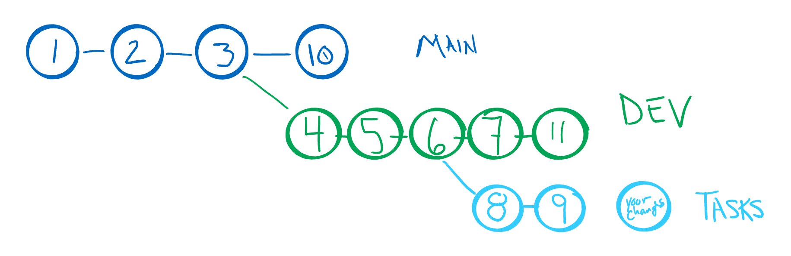
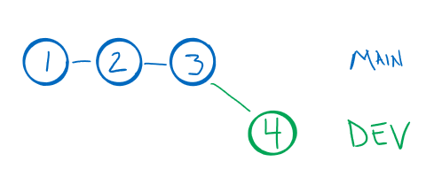

# CSPB-3308  Lab 4 :  Version Control System (VCS)
<figure width=100%>
  
</figure>



An important aspect of successful team projects is using a tool for managing your shared resources.  These resources include code, scripts, documentation, and other files that need to be available to all team members and may change over time.  Managing these resourses can be accomplished by using a Version Control System (VCS) to manage all your development and deployment.   **Git** is a widely used VCS application that is web based and can support hundreds of individual contributors to a project.  The same features that make it great for projects with hundreds of developers also makes it great for small teams of developers.
	
The VCS application allows multiple developers to simultaneously work on the same project files.  The VCS manages the versions of the files so you always know which is the latest version.  But it also remembers all the previous versions of a file.  You can always get an older version of a file or of all the files at a specific time in the development. When two of more developers are making changes to the same files, the VCS will know that a simultaneous change has occurred and will indicate a conflict.  The conflict is resolved by merging the two simultaneous versions into one new version.

Git also allows developers to manage working on multiple project features at the same time.  Git can create individual branches from the main code development source tree where changes can be tried out before merging back into the shared source.  Developers can move between these branches and the VCS will remember the state of each source file and restore that state when changing branches.

This assignment is in the form of a tutorial that will walk through a senario with making changes to files in multiple branches.  Then it will walk through the merge process of combining new code back into the main shared branch of the source tree.

**Objectives**
	
* use VCS to manage changes to project files
* using Git to create and manage development branches
* manage merge conflicts that arise when there are multiple developers
* brief introduction to HTML

<hr>

Project has following folder tree:
```
.  
├── images  
|   └── ...  
├── README.md  
└── LAB_4_STEPS.md
```

| File | Description |
|---|---|
| images                  | directory holding images for README.md |
| &nbsp;&nbsp;&nbsp;&nbsp;...        |  |
| Lab_4_data              | directory holding data used in Lab-4.  There may be multiple data files of each type in the directory |
| &nbsp;&nbsp;&nbsp;&nbsp;sample.html       | file(s) to be used in Lab-4 |
| __README.md__           | __Readme file you are viewing here__ |
| LAB_4_STEPS.md         | Readme file with Lab-4 instructions |


<hr>

### This assignment will focus on intrducing you to branches and merging branches

### Getting Started


Your repository has a file `sample.html` that  will be used to create multiple versions when modifying and merging data within the file.  The repository has the initial `main` branch with this simple file.   In the LAB_4_DATA directory are different variations of that file.  
These variations are what you should be creating and **committing** to the local repository in the steps of the tutorial.<br><br>

For this assignment you will be using a command line to perform the `git` commands.  Although most of these commands can be performed through thte GUI interface, the command lines are much more more explicit.   You will need to open a terminal window and use the linux commands.  We recommend that you use the [csel.io](https://coding.csel.io/) JupyterHub environment.  This development environment provides you with a virtual machine that you can access from any computer.  It maintains the storage of your files and provides needed libraries and applications for the course.
<hr>

## CSPB-3308  [Lab 4 :  Version Control System (VCS)](LAB_4_STEPS.md)
The Lab 4 `LAB_4_STEPS.md` contains the instructions for completing the lab.

### When you have completed the Lab tutorial
Your submission will consist of two items:
   * The modification of the Lab-4 repository by creating new **commits** by **merging** the branches into _MAIN_ and DEV branches. Remember that you must **push** your local repository changes to the remote repository. 
   * Submitting information to the assignment in Moodle.

We suggest that you **commit** and **push** your changes often.  Each time you complete a step of the tutorial and **commit** the changes with the commit message indicating the step, you should also **push** the changes to the remote repository.

**IMPORTANT**: Make sure that all your changes are **pushed** to the remote repository before going to Moodle to submit your completion information in the Moodle assignment.

Here is what you should have accomplished in Lab-4:
	
	1. Created development branches on local and remote
	2. Merged branches locally
	3. Resolved merge conflicts
    4. Removed branches that are no longer relevant
	
<hr><hr><hr>

