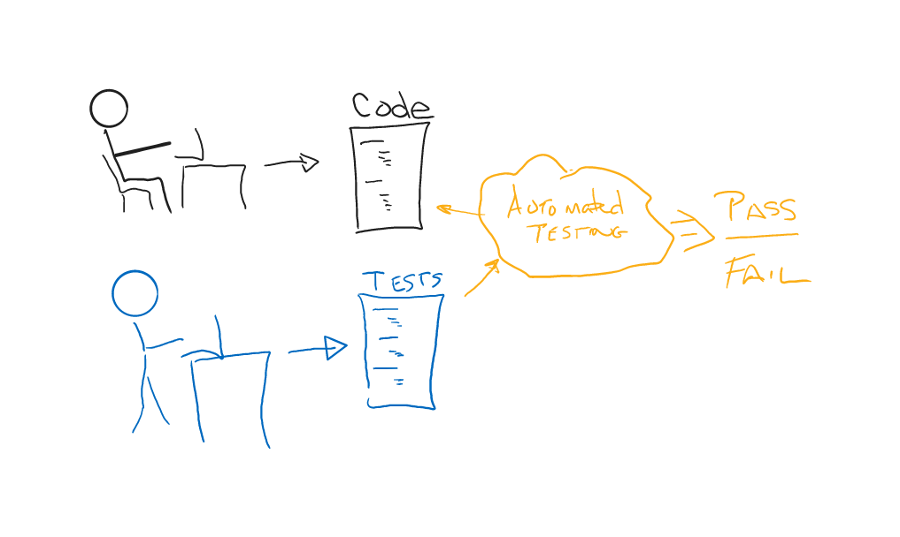

# CSPB-3308  Lab 5 :  Automated Unit Testing
<figure width=100%>
  
</figure>
<hr>
<div>
**Unit Testing** is an extremely important aspect of modern development.  Projects are large and developers will make many changes to the system.  It is mandatory that we are confident that new changes have not invalidated any of the code base.  This is done by providing a set of tests that are run against every version of the code base.  If a version of the code does not pass all the tests, it cannot be delivered to users.
<figure width=100%>
  
</figure>
    
**Unit Testing** is important and valuable for organizations. 
The testing and creation of tests to capture the possible bugs will simultaneously improve code quality and time to release. 
While there are no silver bullets in software development, effective unit tests can speed up development, testing, and even parts of functional requirements development process.
Good unit tests require the code be testable. When a developer knows that their code will be tested it improves the quality.
The tested code will have fewer defects, which means fewer bug fixes, which leads to faster project completion. 

Large projects are constructed from many smaller units.  Each unit is a set of classes and methods or functions that work together to solve a sub-problem within the project.   Many different individuals may need to modify part of a unit or add new functionality to a unit.  Each developer is responsible for making sure the changes they are making will not invalidate any of the other code within the unit.  To guarantee the code will still work, each unit will have a set of **unit tests** that evaluate and validate that all functions and methods are performing correctly.
</div>
<hr>

Each **unit test** that you create in your testing framework will probably have a number of **test cases** to make sure that the code being tested will work in all conditions.

<div>
<figure width=100%>
  
</figure>
    
You have already been using **Unit Testing** without knowing it. Remember when you first started coding and the programming questions where you had to write small snippets of code?  In those problems, you would write some code and the system would test your code.   The tests were written long before you actualy wrote your code.  The tests were based on seeing if your code would produce the correct answer.

Given a description of how the code should behave, we can write a set of tests that make sure the code behaves correctly.  Each of these test cases will test different possible errors that could occur.  

</div>
<hr>

<figure width=100%>
  
</figure>

Creation of the tests needs to consider how the code might fail.
When using strings, we can think about possible ways processing of a string could fail.  
As an example, consider a function that evaluates the contents of a string and think about how string processing might be performed. 
You could iterate through the characters in the string and check for attributes  of the each character or you might write a recursive function.
    
Remember when you were learning how to use arrays and iterating through a list.  You might have had problems with making sure your code started processing with the first character (index 0) and stopped after processing the last character (index n-1). </br>
Often index values can be off by one (iterating from 1 .. n). This would miss a character in the first position. </br>
What happens if we pass the function an empty string?  How can we make sure to catch these bugs in an implementation?
    
What if the function that we are testing will count the number of punctuation characters in a string.  Knowing that the beginning and ending of strings is a problematic area means that we should test those conditions.
* what if a punctuation character is the first character of the string?
* what if a punctuation character is the last character of the string?
* what if a punctuation character is hidden within the string?
* what if there is only one character in the string?
* what if there are no characters in a string?
    
Because we can define multiple ways that the code can fail, we need to make sure we test for each possible failure.  That usually  means we need to define multiple **test cases** within the **unit test**.   If the function being tested can return different values, we need to create  **test cases** that will return different values when testing the function.  It is possible to catch multiple possible bugs with a single test case.  Therefore, there is no set number of test cases required to test a unit. 

Below is a generic set of test cases that would be needed for our punctuation character counting function we described earlier.  </br>
Some of them can be combined, but there are some that are mutually exclusive. </br>
For example, you cannot test both empty string and one character in the string in the same test case.  They would need to be separate test cases.
    
* Does the function return 0 if there are no characters that match
    * does it work with empty string?
    * does it work with single character string?
    * does it work with multiple character string?
    * do any characters that are not supposed to match produce a match?
    
* Does the function return the correct value when there is one match, multiple matches
    * does it work with single character string containing a match?
    * does it work with multiple character string containing a single match?
    * does it work with multiple character string containing  multiple matches?
    * does it work if match is at beginning, middle, end of string?

<hr>

**If you can think of a way to write a function that will pass the tests, but is not a correctly working function, then you are missing test cases.**

Think about creating a set of test cases for another function that analyzes the parameter and returns **True** if the parameter has any punctuation characters. 
What if we created only the following set of test cases:
* "(abc)"
* " DEF.HIJ"
* ".com"

These tests all assume the function will return **True**.  We could write the following code to pass the test:
```
def has_punctuation(str):
   return True
```
This is obviously not a valid solution for the problem.  The code does not even look at the parameter value.   We need to make sure that our **tests** and **test cases** detect all possible return values.
    
Note that this boolean function now places additional constraints on a testcases.  In the previous function that counted punctuation, we could make sure the function found every possible type of punctuation character with a single test case (string with all possible characters returning the correct count).  If the function missed any of the characters, it would return the wrong value.  However in the boolean function, each individual punctuation character will need a test case of its own.  If two punctuation characters are in a string, we dont know if it saw one or both because it only returns **True** or **False**.

<hr>

When creating a set of test cases for a function that analyzes the parameter and returns the number of characters that match some attribute. 
We could count the number of punctuation in a string and make sure the function returns the correct value. If we were to only use the following tests:
```
assertEqual(3, count_punctuation("aaa..."))
assertEqual(3, count_punctuation("bbb,,,"))
assertEqual(3, count_punctuation("CCC.,?"))
```
We could write the solution below to pass all these tests:
```
    def count_punctuation(str):
       return 3
```
Again, this is not a valid solution, but it passes the tests given.  Your tests need to verify that different correct values are returned by the function. The code solution also does not check to see if the function will detect the other punctuation besides the three **.,?** given in the test cases. We do not know if the function will find all the different punctuation such as **;:[]{}()*%$#@!** or any other characters defined as punctuation.
    
These examples are extreme cases, but they demonstrate that the tests must try to catch possible errors that **COULD**  occur.  

<hr><hr>

### Testing a Class Definition
In this assignment we have provided you with a definition of a class called **CharacterCounter** in file `CharacterCounter.py`.
It has a data member named **text** and five methods defined.
There are also a couple of other methods defined for the class.  One is the constructor that is called when creating an instance of the class.  Notice that each instance is constructed using a string parameter.  The given string is copied into the class data member **text**.  All the methods of the class will only look at the string stored in the instance.
    
```
class CharacterCounter:
    """
    Class for counting the number of occurrences in strings

    Attributes
    ----------
        text : str       - string on which all methods will operate

    Methods
    -------
        count()          - Count number of characters in text
        count_alpha()    - Count number of alphabetic characters in text
        count_numeric()  - Count number of numeric characters in text
        count_vowels()   - Count number of vowels in text
        is_phonenumber() - Check if text is a valid US phone number

    """
```
    
### Creating Tests for a Class Method
When given the definition of a function and you need to write a test for that function, do not look at the implementation, just the specifications.    
For example, the specification for a method that counts the number of punctuation characters in a class data member might look like the following:
```
def count_punctuation(self):
    """
    Count number of punctuation characters in text data member
    The following are the characters we consider to be punctuation:
    !,.:;()[]{}@$%&^*#

    :return: Number of punctuation characters

    """
```
Now we know that a **unit test** for the function needs to be written.  We know that the **unit test** will contain a number of **test cases** that must work in order for the **unit test** to be successful.  Without knowing the implementation,  we can come up with a set of conditions to be tested.
    
My **unit test** for this function would include the following **test cases**:
* empty string
* string with single punct
* string with single non-punct
* string with every possible punct
* string with multiple non-punct (digits, alpha, ???)
* string with mixed punct, non-punct 
* string with mixed punct, non-punct, punct at start 
* string with mixed punct, non-punct, punct at end
* string with mixed input, random string(s) (with pairs digit-punct, alpha-punct within string)
I would make sure that each of the strings with multiple punctuation returns a different value.

Here is what my unit test for this method would look like:

```
    def test_count_punct(self):
        test_str =  "test: empty string"   # use this string to comment what the test is doing and can be used in the output on a failure
        p = test.Processor("")       # create an object to be tested and give it the string to be tested (empty string in this case)
        self.assertEqual(p.count_punct(), 0, "Failed "+test_str)

        test_str =  "test: single non-punct (alpha)"
        p = test.Processor("A")  
        self.assertEqual(p.count_punct(), 0, "Failed "+test_str)

        test_str =  "test: single non-punct (digit)"
        p = test.Processor("5")  
        self.assertEqual(p.count_punct(), 0, "Failed "+test_str)

        
        test_str =  "test: single punct '?'"
        p = test.Processor("?")  
        self.assertEqual(p.count_punct(), 1, "Failed "+test_str)

        test_str =  "test: single punct '!'"
        p = test.Processor("!")  
        self.assertEqual(p.count_punct(), 1, "Failed "+test_str)
    
        every_punct = "!,.:;()[]"
        test_str =  "test: half the punct "
        p = test.Processor(every_punct)  
        self.assertEqual(p.count_punct(), 9, "Failed "+test_str)
        
        # . . .  
        # same idea for all the other test cases
```

There are lots of other characters that might not work correctly.  We did not look at each of the possible punctuation characters to see if they would be counted.  There are other letters and digits that might cause a mismatch and be incorrectly counted.  A testcase for each character could be writte, but that would create too many testcases.  But we can combine many of the characters together into one test case.  For example all the digits could be placed in a string.  The function should not count any of those characters.

All the tests for a function can be placed into one test function.  The Python testing framework will automatically see the functions with names starting "test" and will automatically call those functions when running tests.
<hr>

### Creating Test file for CharacterCounter
You have been given a template for writing your tests.  The **Test_CharacterCounter.py** file contains the basics for writing a unit test.
There is also a method within the file that shows you a short cut for creating multiple tests.  It involves creating a list with tuples of string and expected results.
The code then iterates through each of those list items to assert that the results are as expected.

Each of the methods in the class will need to be tested.  A common way to create test functions is to create one test routine for each method.
The individual test routines will have one or more (usually more) test cases that are tried before declaring the method tested.
You will be filling in the testing framework to test all the methods listed in **Part 1**.
    
<hr><hr>
    
## Part 1 : Create Tests for CharacterCounter Class (Individual Activity)
You will create the tests for the **CharacterCounter** class in the **Test_CharacterCounter.py** file.  
There are errors in the implementation we have given you in **CharacterCounter.py**.  
Your tests must find all the failures on the functions with invalid implementations.
    
You must provide:    
* Write test cases to verify the constructor raises an error if passed something other than a string
* Write one or more  test cases to test the count() method
* Write one or more  test cases to test the count_alpha() method
* Write one or more  test cases to test the count_numeric() method
* Write one or more  test cases to test the count_vowels() method
* Write one or more  test cases to test the is_phonenumber() method

I will run your tests using the following command:
```
python3 ./Test_CharacterCounter.py -v 
```

<hr>
    
## Part 2 : Create Corrected Implementation of CharacterCounter Class (Individual Activity)
You will copy the current implementation (that has errors) and create a new file called **FixedCharacterCounter.py**.  In this new file you will fix all the errors that were in the original implementation.

I will run my version of the unit test on your FIXED implmentation.
<hr>

## Required Submission

##### **Although your assignment will be graded from your files in the remote repository,**
##### **You must submit the following text when you have completed the assignment:**
* Your name: 
* CU ID:
* GitHub Username:
* Hours to complete:

**IMPORTANT**: Make sure that all your added files and changes are **pushed** to the remote repository before going to Moodle to submit your completion information in the Moodle assignment.
<hr><hr><hr>

